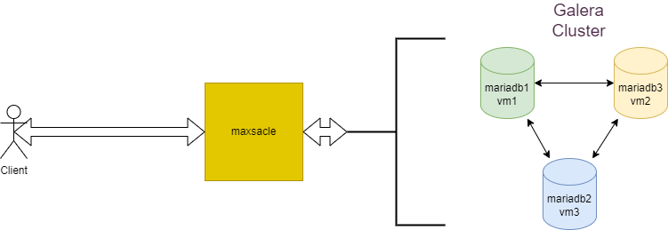

# Simple Galera Cluster Ansible 

## Edit 🖊️ for use

just edit this files :

- main.yml
- inventory/hosts
- inventory/group_vars/all
  
**if you want to add more galera nodes**

- edit maxscale/templates/maxscale.cnf.j2

## after all ✔️

just run `ansible-playbook -i inventory/hosts main.yml --ask-become-pass`

## network diagram

